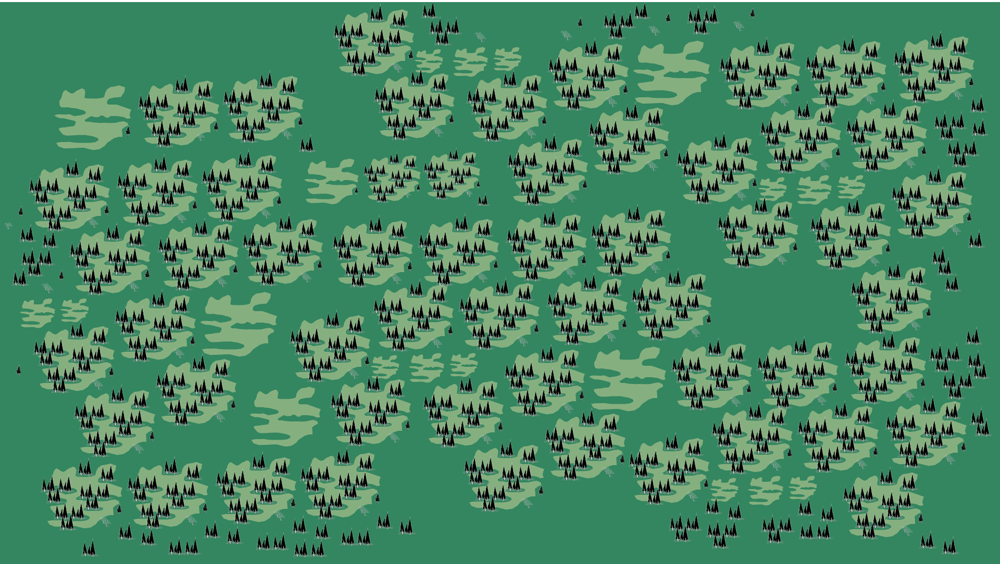
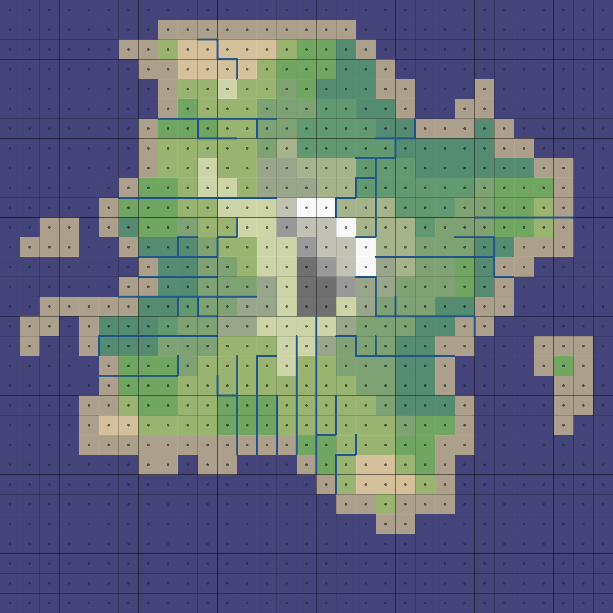

<a name="intro"></a>
# KNIS - Exploration Game
Exploration crawler. Think Hyper Light Drifter controls mixed with Sunless Sea exploration, achievement-seeking of Guild Wars 2 and the atmospheric journey of Below.





.png)
.png)	
	





Technical

Base frame: 256 x 144 px (make multiples of this or extrapolation)

Music

Glitchy, positive, sense of wonder and courage. http://audiojungle.net/item/exploring/10431972 http://audiojungle.net/item/the-explorers/9937094 http://audiojungle.net/item/exploring-the-earth/9949363 http://audiojungle.net/item/exploring-the-city/7396658 desert: http://audiojungle.net/item/exploration-intensifies/8844160 check this for general feel: http://audiojungle.net/item/a-world-to-explore/1772729

Principles

The main purpose of interaction is to create a feeling of presence. Keep systems simple, and extend them using imagination

direct control of the avatar
constant input to maintain the illusion
agreeable action outcome
deterministic mechanics (ability to plan ahead)
hidden actions (unlockable, not visible initially - new option bubbles)
no repetitions
consistency
responsive world
aesthetics matter
avoid fail-safes
local activities
Regions (201/200)

Ancient Forest
Lakeside
Fields of Fortress
Len'a Shar
Endless City
Plain
Hills
Valley
Rocky Plain
Rocky Hills
Rocky Valleys
Alluvial Fan
Arch Archipelago
Arete
Arroyo
Atoll
Badlands
Bar
Barrier Island
Basin
Bay
Bayou
Beach
Bight
Bluff
Box Canyon
Bowl
Brook
Butte
Caldera
Canal
Canyon
Cape
Cataract
Cave
Cavern
Channel
Chasm
Chimney
Cinder Cone
Cirque
Cliff
Coast
Coastline
Col
Continent
Coral Reef
Cove
Crag
Crater Lake
Creek
Crest
Crevasse
Dale
Dell
Delta
Depression
Desert
Divide
Dome
Drift
Dune
Equator
Escarpment
Estuary
Falls
Fault
Firth
Fissure
Fjord
Foothills
Fork
Gap
Geology
Geomorphology
Geyser
Glacier
Glacier Cave
Glen
Gorge
Grotto
Gulch
Gulf
Gully
Headland
Headwaters
Highland
Hillside
Hollow
Iceberg
Ice Cliff
Ice Field
Inlet
Island
Islet
Isthmus
Knob
Knoll
Lagoon
Lake
Lakebed
Landform
Latitude
Lava Dome
Lava Tube
Ledge
Loess
Longitude
Lowland
Mainland
Marsh
Meander
Mesa
Mid-ocean Ridge
Moraine
Mound
Mountain
Mountain Peak
Mountain Pass
Mouth
Mud Flat
Narrows
Natural Arch
Neck
Oasis
Ocean
Oceanic Trench
Overhang
Overlook
Oxbow Lake
Pass
Peak
Peninsula
Plateau
Playa
Point
Pond
Prairie
Promontory
Range
Rapids
Ravine
Reef
Ria
Ridge
Rift Valley
Rill
Rise
River
Riverbed
River Delta
Rivulet
Rock
Salt Marsh
Sandbar
Sand Dune
Scarp
Scree
Shore
Shoreline
Slope
Slough
Sound
Source
Spit
Spring
Strait
Stream
Summit
Surf
Swamp
Oasis
Topography
Tributary
Tundra
U-shaped Valley
Vale
Vent
Volcano
Waterfall
Brachan
Erg
Blowout
Desert Pavement
Dry Lake
Ventifact
Yardang
Dreikanter
Machair
Hogback
Monadnock
Bench
Esker
Floodplain
Towhead
Shoal
Scowle
Ait
Sinkhole
Icefield
Locations (100/650)

Roadside
Abandoned Camp
Ruins
Workshop
Settlement
Exploration Guild Outpost "The wisest constantly look... and discover unimaginable things out there in the world. Are you brave enough to venture out? Become an explorer, bring me the Eyeing Deed to prove once you come back to me that you in fact visited these locations. I don't know what's out there..."
Erenhot "Old story about a distant island with an outpost of imperial guard."
Forgotten Battle
Kingdom's Gates
Altar
Temple Ruins
Cave of Owl
City of Stone and Dirt (Pratchett style short story)
Marooned Ship
Only Inhabited House In A Ghost Town
Orphanage
Outdoor Carnival
Pantry
Park
Pavilion
Pier
Pirate Cave While Pirates Are Away
Place of Worship
Pocket Dimension
Prison
Clock Tower
Stone Circle
Lodge
Chambers
Garden
Embassy
Monument
Farm Fields
Docks
Cellar
Cemetery
Church
Abandoned Mines
Battlements
City Gates
Castle Wall
Monastery
Tavern
Bathhouse
Bridge
Gallows
Slum
Greenhouse
Junkyard
Library
Dig
Apothecary's Shop
Blacksmith's Shop
Cathedral
Cobbler's Shop
Cottage
Dungeon
Farmhouse
Fort
Galley
Guildhall
Hermit's Cave (Plato's Cave)
Well
Tree House
Vault
Square
Quicksand
Great Hall
Wagon Encampement
Monolithic Stones
Bazaar
Meadow
Mill
Crypt
Moor
Mountain Top
Noble's Quarters
Gallows Tree
Hot Springs
Drawing Room
Harem
Haunted Woods
Hedge Maze
Halfling Hole
Hollow Trunk
Crossroads
Blind Man'sHouse
Giant Tree
Brewery
Brothel
Burned Tower
Wood Cabin
Army Camp
Hovel
Longship
Magic Shop
Nunnery
Outhouse
Shepherd's Hut
Stables
Activities (800)

Royal Hunt
Ceremony
Endless City (taken from my dreams, construct) - Endless City Tour
Endless City - Witchhunt for Blame
Len'a Shar - Alive
Len'a Shar - Elder Council
Len'a Shar- Children of Stars
Len'a Shar - Eye of Aerim
Len'a Shar - Soul Sold
Swamiji People
Novel Game - in-game character that wrote a novel that you can read. Side character specially for my grandfather who insists I write a book, novel, philosophical treaty as the only means of fulfilling myself
Harnon & Volgfrak
Supplies (Items)

Campfire Material (ability to set up a campfire on the tract)

Campfire Bundle Trade Icon
Setup Campfire Animation
Grounded Campfire Animation
Lit Campfire Animation
Burned Campfire Animation
Campfire Remains Icon (4 x can be returned to trade for a Campfire Bundle)
Torches

Torch Bundle Trade Icon
Setup Held Lit Torch Animation
Held Lit Torch Animation
Held Burned Torch Animation
Grounded Lit Torch Animation
Grounded Burned Torch Animation
Food (bonuses to endurance)

Stew
Bread
Eyeing Deeds (650)

Journal Logs

Event Cards

Languages (3/12)

Third Language (Common)
Language of Tho'ra (Asemic Language)
Markings
Features

Learn 12 different languages
Explore 130 regions & a vast expanse of locations
Card shapes and skill selectors (Inventory, Set up camp, Map)
Achievements you have to turn in
Guild of Discovery
Fog of Exploration
Underlying Mystery
Top-down 2D perspective
Choose Your Character
Unlockable Characters From Discovered Regions
No Visible Map Boundaries
Track Feet Particles (appear for a specific duration so you can backtrack yourself and after the time is over they gradually fade out)
Activity Ping for Events + Journal Overlay (Activities are in fact logs that let you write themselves by choosing what happened via event cars - "You managed to escape" / "You talked to the trader")
Day/Night Cycle
Sprint Feature/Endurance
Wandering Dog/Companions
Discovery Charter Guild
Vases x
Lore Tomes x
Stashes x
Artifacts x
Objects x
Money x
Voices x
Tales x
Story Types

Basic Premise Voyage and Return - Hero visits exotic land, triumphs, then returns as a changed man.

Others

Supplication - Persecutor accuses the Suppliant of wrongdoing, and the Power makes a judgment against the Suppliant
Deliverance - Unfortunate has caused a conflict, and the Threatener is to carry out justice, but the Rescuer saves the Unfortunate
Crime Pursued by Vengeance - The Criminal commits a crime that will not see justice, so the Avenger seeks justice by punishing the Criminal
Vengeance taken for kin upon kin - Two entities, the Guilty and the Avenging Kinsmen, are put into conflict over wrongdoing to the Victim, who is allied to both
Pursuit - The Fugitive flees Punishment for a misunderstood conflict
Disaster - The Power falls from their place after being defeated by the Victorious Enemy or being informed of such a defeat by the Messenger
Falling Prey to Cruelty of Misfortune - The Unfortunate suffers from Misfortune and/or at the hands of the Master
Revolt - The Tyrant, a cruel power, is plotted against by the Conspirator
Daring Enterprise - The Bold Leader takes the Object from the Adversary by overpowering the Adversary
Abduction - The Abductor takes the Abducted from the Guardian
The Enigma (temptation or a riddle) - The Interrogator poses a Problem to the Seeker and gives a Seeker better ability to reach the Seeker's goals
Obtaining - The Solicitor is at odds with the Adversary who refuses to give the Solicitor what they Object in the possession of the Adversary, or an Arbitrator decides who gets the Object desired by Opposing Parties (the Solicitor and the Adversary)
Enmity of Kin - The Malevolent Kinsman and the Hated or a second Malevolent Kinsman conspire together
Rivalry of Kin - The Object of Rivalry chooses the Preferred Kinsman over the Rejected Kinsman
Murderous Adultery - Two Adulterers conspire to kill the Betrayed Spouse
Madness - The Madman goes insane and wrongs the Victim
Fatal Imprudence - The Imprudent, by neglect or ignorance, loses the Object Lost or wrongs the Victim
Involuntary Crimes of Love - The Revealer betrays the trust of either the Lover or the Beloved
Slaying of a Kinsman Unrecognized - The Slayer kills the Unrecognized Victim
Self-Sacrificing for an Ideal - The Hero sacrifices the Person or Thing for their Ideal, which is then taken by the Creditor
Self-Sacrifice for Kindred - The Hero sacrifices a Person or Thing for their Kinsman, which is then taken by the Creditor
All Sacrificed for Passion - A Lover sacrifices a Person or Thing for the Object of their Passion, which is then lost forever
Necessity of Sacrificing Loved Ones - The Hero wrongs the Beloved Victim because of the Necessity for their Sacrifice
Rivalry of Superior and Inferior - A Superior Rival bests an Inferior Rival and wins the Object of Rivalry
Adultery - Two Adulterers conspire against the Deceived Spouse
Crimes of Love - A Lover and the Beloved enter a conflict
Discovery of the Dishonor of a Loved One - The Discoverer discovers the wrongdoing committed by the Guilty One
Obstacles to Love - Two Lovers face an Obstacle together
An Enemy Loved - The allied Lover and Hater have diametrically opposed attitudes towards the Beloved Enemy
Ambition - The Ambitious Person seeks the Thing Coveted and is opposed by the Adversary
Conflict with a God - The Mortal and the Immortal enter a conflict
Mistaken Jealousy - The Jealous One falls victim to the Cause or the Author of the Mistake and becomes jealous of the Object and becomes conflicted with the Supposed Accomplice
Erroneous Judgment - The Mistaken One falls victim to the Cause of the Author of the Mistake and passes judgment against the Victim of the Mistake when it should be passed against the Guilty One instead
Remorse - The Culprit wrongs the Victim or commits the Sin, and is at odds with the Interrogator who seeks to understand the situation
Recovery of a Lost One - The Seeker finds the One Found
Loss of Loved Ones - The killing of the Kinsman Slain by the Executioner is witnessed by the Kinsman Spectator
Unity Tools & Tuts

2D Pixel Grid ($5) https://www.assetstore.unity3d.com/en/#!/content/23604
Pixelate - Per Object ($25) https://www.assetstore.unity3d.com/en/#!/content/14252
UniArt Pixel SciFi Landscape ($45) https://www.assetstore.unity3d.com/en/#!/content/19449
Low Poly Strategy Prototyper ($49.99) https://www.assetstore.unity3d.com/en/#!/content/22817
Explorer's Music Pack ($10) https://www.assetstore.unity3d.com/en/#!/content/15860
Pixel Perfect Plugin https://www.assetstore.unity3d.com/en/#!/content/14498 ($10)
RagePixel Toolkit for Unity Editor http://ragepixel.com/
Pixel Perfect 2D in Unity http://blogs.unity3d.com/2015/06/19/pixel-perfect-2d/
Making 2D Games without any extra tools https://maniacdev.com/2012/02/developing-2d-games-in-unity-3d-without-paying-extra-for-tools
https://www.reddit.com/r/Unity2D/comments/2bsoj1/recommended_best_practices_for_pixel_art_games/
https://www.reddit.com/r/Unity2D/comments/2bl6t9/whats_the_best_unity_2d_tutorial_out_there_and/
Making a FB game https://www.scirra.com/tutorials/58/how-to-make-a-facebook-game/page-2
https://www.youtube.com/watch?v=cL9iHR1JxcE&feature=youtu.be
Pixel Perfect Rotation ($5) https://www.assetstore.unity3d.com/en/#!/content/33829
https://www.youtube.com/watch?v=jNiCEUisrRM&list=PLUCGcb0ogekiVGmdDbc-n4QBM421G7xtH&index=6
Alternative Control Approach https://www.youtube.com/watch?v=VPsX3T2o5B4&list=PLFXYYxmSM-GcC49C1FAhKDv4JlQq8O3Gx&index=6
Promotional Videos & Sites

Knis - Trailer Knis is an exploration crawler set in a xxx

www.cyberhippie.co/knis www.indiedb.com/games/knis www.twitter.com/mothnode

Knis - Introduction to Lore

www.cyberhippie.co/knis www.indiedb.com/games/knis www.twitter.com/mothnode

Knis - Features

www.cyberhippie.co/knis www.indiedb.com/games/knis www.twitter.com/mothnode

Knis - 15 Minutes Of Gameplay

THE SOFTWARE IS PROVIDED "AS IS" WITHOUT WARRANTY OF ANY KIND, EXPRESSED OR IMPLIED, INCLUDING BUT NOT LIMITED TO THE WARRANTIES OF MERCHANTABILITY, FITNESS FOR A PARTICULAR PURPOSE AND NONINFRINGEMENT. IN NO EVENT SHALL THE AUTHORS OR COPYRIGHT HOLDERS BE LIABLE FOR ANY CLAIM, DAMAGES OR ANY OTHER LIABILITY WHETHER IN AN ACTION OF CONTRACT, TORT OR OTHERWISE, ARISING FROM, OUT OF OR IN CONNECTION WITH THE SOFTWARE OR THE USE OR OTHER DEALINGS WITH THE SOFTWARE.


Description.


Description.


### Table of Contents
1. [Introduction.](#intro)
2. [Features.](#features)
3. [Issues.](#issues)
4. [Icebox.](#icebox)
5. [Installation and usage guide.](#install)
6. [Contributing.](#contribute)
7. [License.](#license)
8. [Credits.](#credits)
9. [Commit Glyphs.](#glyphs)

<a name="features"></a>
### Features
+ Feature_01
+ Feature_02
+ Feature_03

<a name="issues"></a>
### Issues
+ Issue_01
+ Issue_02
+ Issue_03

<a name="icebox"></a>
### Icebox
+ Idea_01
+ Idea_02
+ Idea_03

<a name="install"></a>
### Installation and Usage Guide
Include basic necessary components. Gifs if required.
```
1. 
2. 
3. 
```

<a name="contribute"></a>
### Contributing
Insert project contribution rules if allowed.

<a name="license"></a>
### License
Insert project licensing options if there are any.

<a name="credits"></a>
### Credits
Insert project creator entities, contributors and their respective presence links.

<a name="glyphs"></a>
### Commit Glyphs

+ ☰ Code structure and formatting
+ ▲ Performance improvements
+ ⨯ File deletion
+ ∗ Bugfix
+ ⬡ New Feature
+ ⎔ Documentation
+ ❑ UI design
+ ⚑ Release

